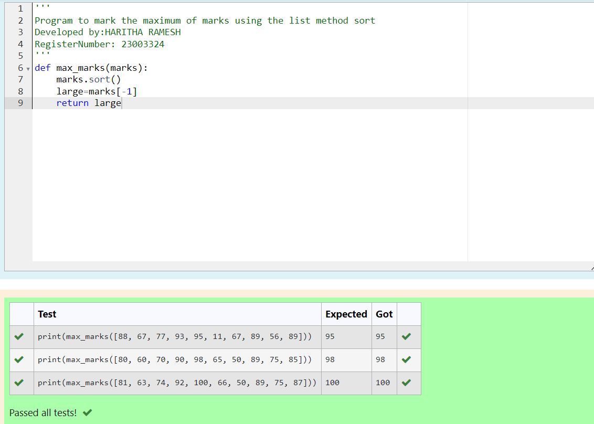
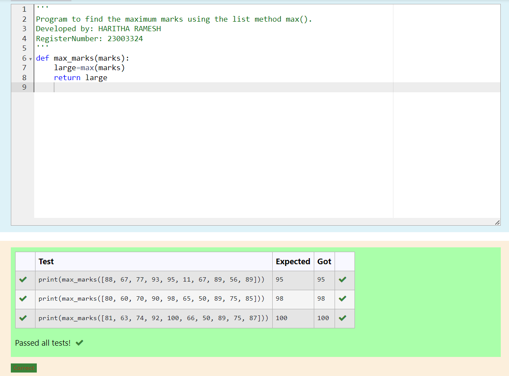
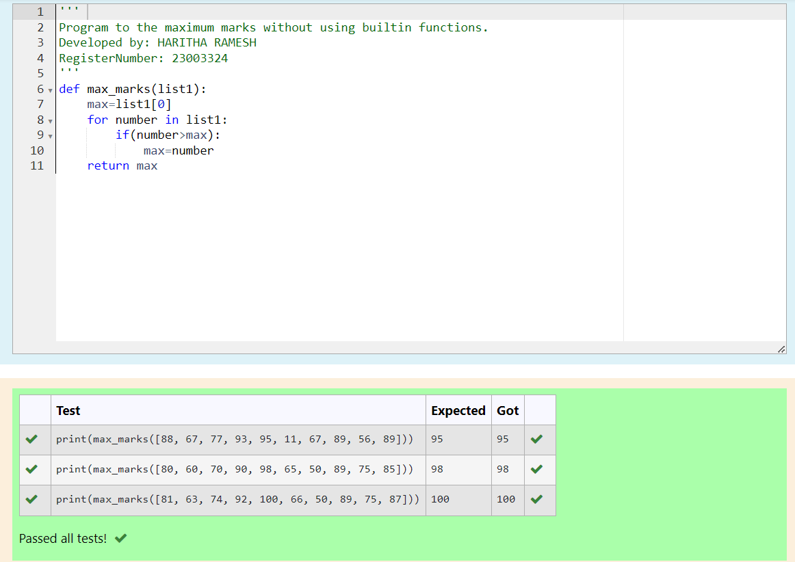

# Find the maximum of a list of numbers
## Aim:
To write a program to find the maximum of a list of numbers.
## Equipment’s required:
1.	Hardware – PCs
2.	Anaconda – Python 3.7 Installation / Moodle-Code Runner
## Algorithm:
1.	Get the list of marks as input
2.	Use the sort() function or max() function or use the for loop to find the maximum mark.
3.	Return the maximum value
## Program:

i)	# To find the maximum of marks using the list method sort.
```
Program to mark the maximum of marks using the list method sort
Developed by:HARITHA RAMESH 
RegisterNumber: 23003324
'''
def max_marks(marks):
    marks.sort()
    large=marks[-1]
    return large

```

ii)	# To find the maximum marks using the list method max().
```
Program to find the maximum marks using the list method max().
Developed by: HARITHA RAMESH
RegisterNumber: 23003324
'''
def max_marks(marks):
    large=max(marks)
    return large
    
```

iii) # To find the maximum marks without using builtin functions.
```
Program to the maximum marks without using builtin functions.
Developed by: HARITHA RAMESH
RegisterNumber: 23003324
'''
def max_marks(list1):
    max=list1[0]
    for number in list1:
        if(number>max):
            max=number
    return max

```
## Sample Input and Output:


.png)


## Output:
 Program to mark the maximum of marks using the list method sort

Program to find the maximum marks using list method max()


Program to the maximum marks without using builtin functions



## Result:
Thus the program to find the maximum of given numbers from the list is written and verified using python programming.